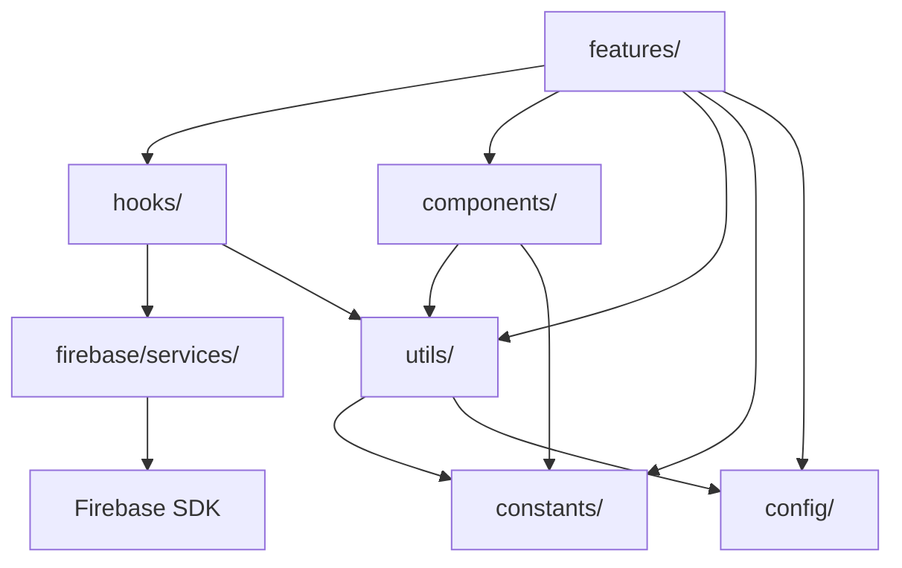
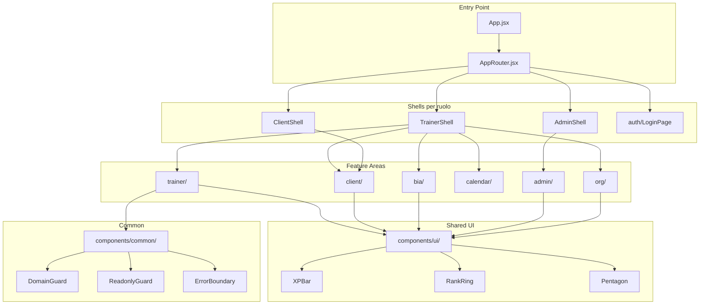
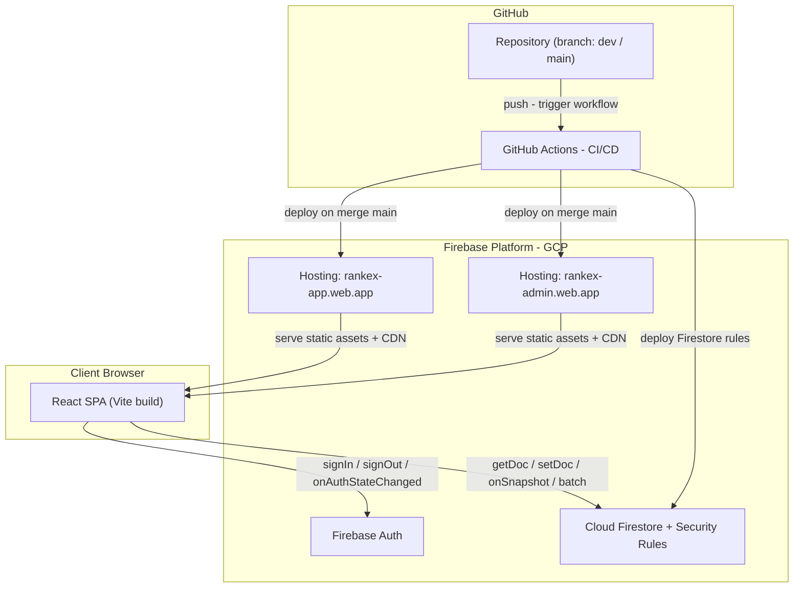
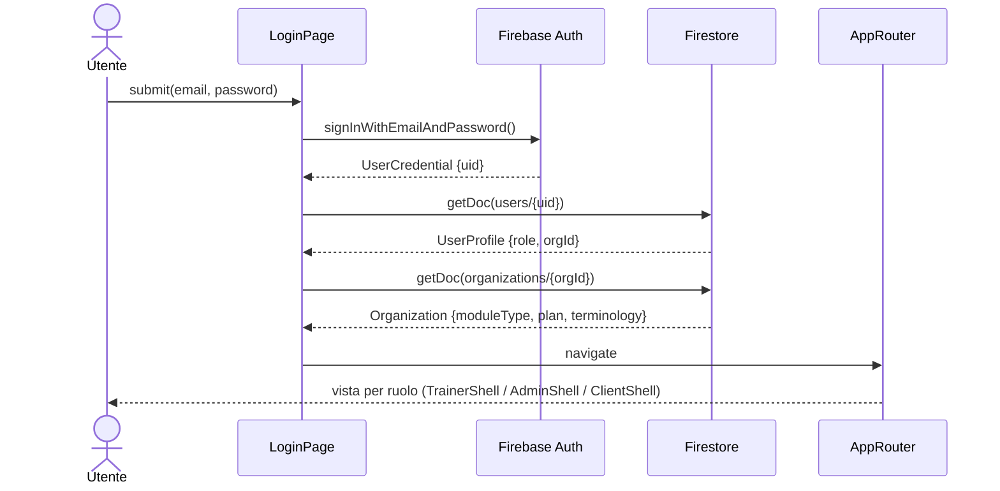
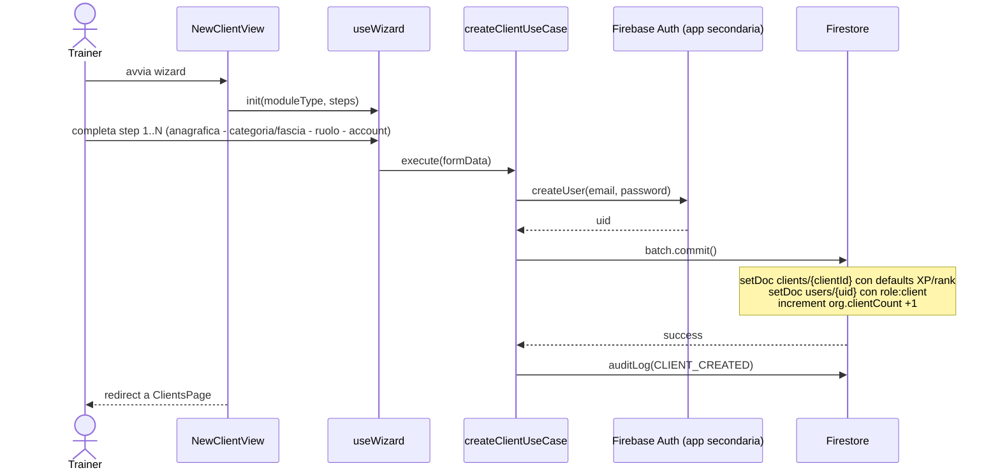
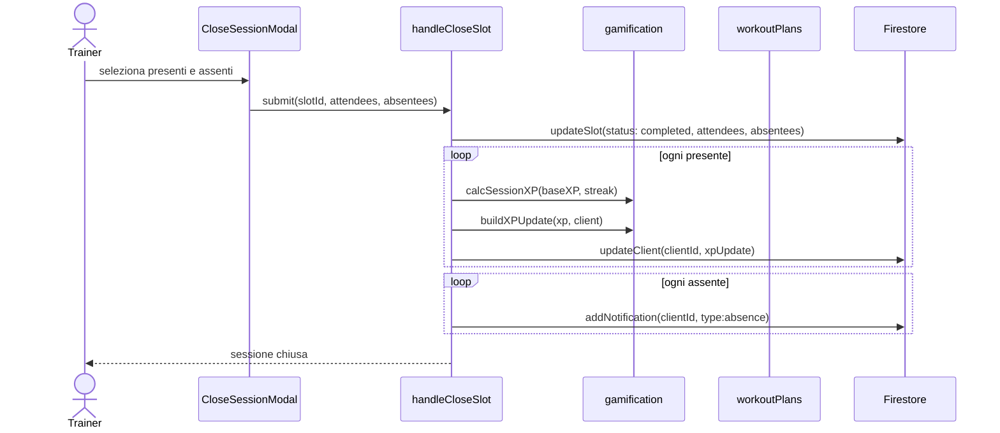
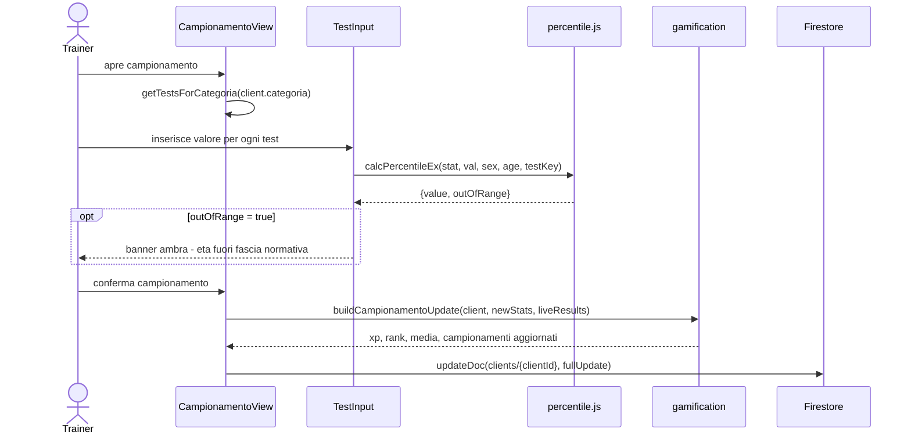
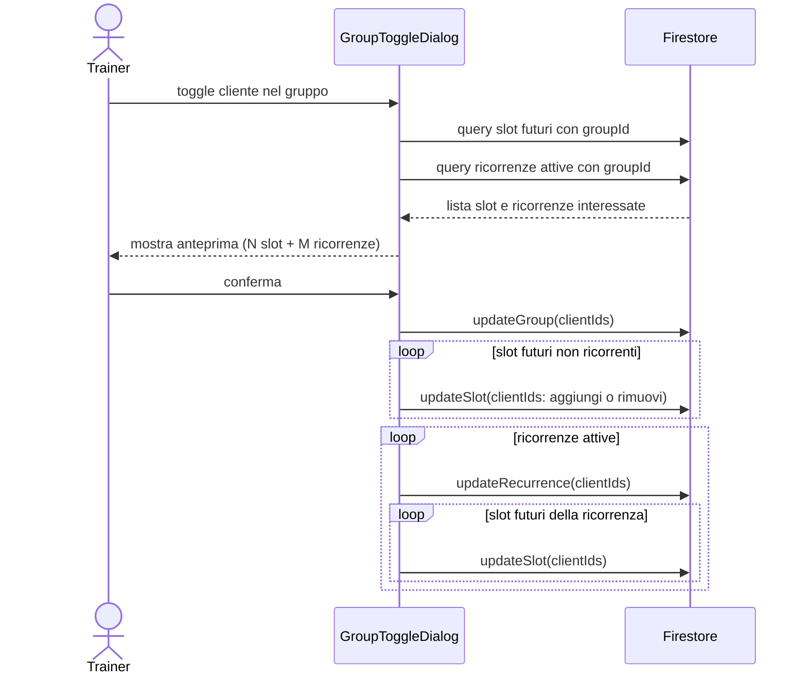
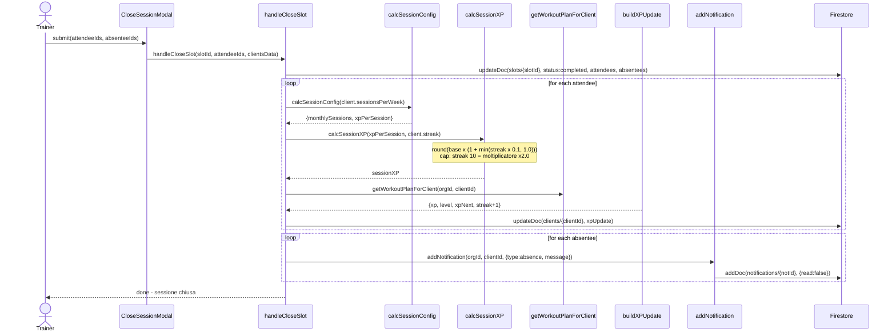
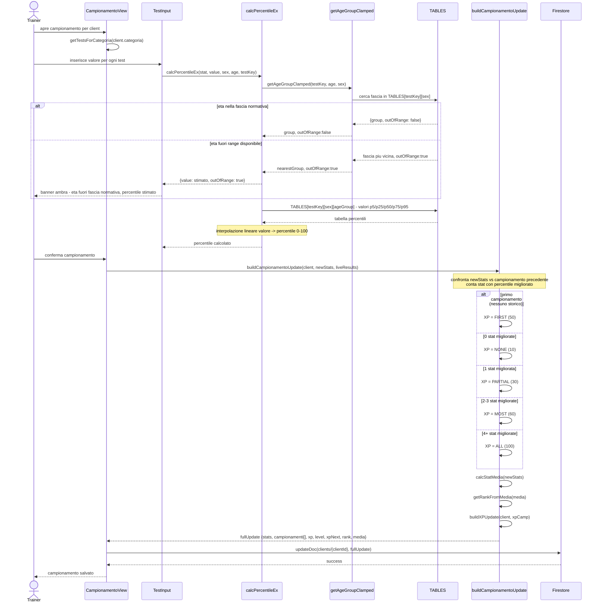

# RankEX — Design Review

**Versione:** 1.0
**Data:** 24 aprile 2026
**Autore:** Lamberti Valerio
**Stato:** Draft

---

## Indice

1. [Esigenza](#1-esigenza)
2. [Esito Atteso](#2-esito-atteso)
3. [Attori del Sistema](#3-attori-del-sistema)
4. [Casi d'Uso](#4-casi-duso)
5. [Vincoli Normativi](#5-vincoli-normativi)
6. [Caratteristiche del Sistema](#6-caratteristiche-del-sistema)
7. [Make or Buy](#7-make-or-buy)
8. [Design di Alto Livello](#8-design-di-alto-livello)
   - [8.1 Servizi Cloud](#81-servizi-cloud)
   - [8.2 Vista Statica delle Componenti](#82-vista-statica-delle-componenti)
   - [8.3 Vista Dinamica delle Componenti](#83-vista-dinamica-delle-componenti)
   - [8.4 Design di Dettaglio](#84-design-di-dettaglio)

---

## 1. Esigenza

Il mercato del fitness professionale e delle accademie sportive è caratterizzato da una forte frammentazione degli strumenti digitali: trainer e coach utilizzano fogli Excel per tracciare i progressi atletici, app generiche per comunicare con gli atleti, e strumenti separati per la pianificazione degli allenamenti. Questo genera ridondanza di dati, perdita di storico e assenza di insight oggettivi sulle performance.

**Problemi specifici identificati:**

- I **personal trainer** non dispongono di un sistema strutturato per campionare e confrontare nel tempo i risultati dei test atletici con tabelle percentili normative basate su letteratura scientifica.
- Le **accademie calcistiche** tracciano manualmente le performance fisiche degli allievi, senza distinzione per fascia d'età e senza comparazione con standard validati.
- L'**engagement degli atleti** è basso: mancano meccanismi di motivazione intrinseca (livelli, rank, streak) che rendano visibili i progressi nel tempo e incentivino la continuità.
- La **comunicazione trainer-atleta** è dispersa su canali non strutturati (WhatsApp, email), senza storico collegato al profilo atletico dell'atleta.
- La gestione del **calendario sessioni** è disconnessa dal tracking delle presenze, dalla distribuzione di premi (XP) e dalle comunicazioni automatiche agli atleti assenti.
- Non esiste uno strumento che supporti nativamente **più modelli di business** (personal training, accademia calcistica) con terminologie, test e workflow differenziati all'interno della stessa piattaforma.

---

## 2. Esito Atteso

RankEX è una piattaforma SaaS multi-tenant che centralizza tracking atletico, gamification, comunicazione e gestione del calendario in un unico ambiente operativo. Gli esiti attesi a regime sono:

| Dimensione | Obiettivo |
|------------|-----------|
| **Efficienza operativa** | Riduzione del tempo di analisi performance rispetto a Excel grazie a percentili automatici e dashboard centralizzata |
| **Engagement atleti** | Aumento della continuità di allenamento tramite XP, rank, streak e notifiche strutturate |
| **Scalabilità** | Da un singolo PT (piano free: 1 trainer, 10 clienti) a organizzazioni enterprise con centinaia di atleti |
| **Qualità del dato** | Percentili normativi scientifici per 13 test PT e 5 test soccer, con gestione fasce d'età e warning automatici |
| **Comunicazione strutturata** | Thread note con accesso differenziato per ruolo, storico collegato al profilo atleta |
| **Multi-dominio** | Supporto nativo e coesistente per personal training e accademie calcistiche all'interno della stessa infrastruttura |

---

## 3. Attori del Sistema

| Attore | Descrizione | Dominio di accesso |
|--------|-------------|-------------------|
| **super_admin** | Team RankEX — visibilità globale su tutte le organizzazioni, gestione piattaforma e audit log | `rankex-admin.web.app` |
| **org_admin** | Responsabile di una singola organizzazione — gestisce membri del team, impostazioni e piano SaaS | `rankex-app.web.app` |
| **trainer** | Coach / personal trainer — operatività completa su clienti, sessioni, test, schede allenamento | `rankex-app.web.app` |
| **staff_readonly** | Assistente / analista — accesso in sola lettura a tutti i dati dell'organizzazione | `rankex-app.web.app` |
| **client** | Atleta / membro — accede solo ai propri dati, può commentare note e visualizzare la propria scheda | `rankex-app.web.app` |

**Gerarchia di accesso:**

```
super_admin > org_admin > trainer > staff_readonly > client
```

La separazione tra dominio app e dominio admin è enforced in produzione tramite `DomainGuard` — nessun ruolo non-admin può accedere al dominio admin e viceversa.

---

## 4. Casi d'Uso

### 4.1 Super Admin

| ID | Caso d'Uso | Flusso |
|----|-----------|--------|
| UC-SA-01 | Crea nuova organizzazione (nome, modulo, piano, owner) | F06 |
| UC-SA-02 | Visualizza lista organizzazioni con utilizzo piano (barre progresso trainer/clienti) | F07 |
| UC-SA-03 | Legge audit log globale (login, logout, create/delete client) | F08 |
| UC-SA-04 | Modifica propria email e password | F48 |

### 4.2 Org Admin

| ID | Caso d'Uso | Flusso |
|----|-----------|--------|
| UC-OA-01 | Invita membro del team (crea account Firebase + profilo + incrementa counter) | F09 |
| UC-OA-02 | Modifica ruolo membro esistente | F09 |
| UC-OA-03 | Rimuove membro (decrementa counter) | F09 |
| UC-OA-04 | Configura organizzazione (nome, variante terminologia, piano SaaS) | F10 |
| UC-OA-05 | Visualizza blocco piano al raggiungimento del limite trainer | F11 |

### 4.3 Trainer

| ID | Caso d'Uso | Flusso |
|----|-----------|--------|
| UC-TR-01 | Autenticazione (login, reset password, session timeout) | F01, F03, F04 |
| UC-TR-02 | Cambio password obbligatorio al primo accesso | F02 |
| UC-TR-03 | Crea cliente — wizard PT (3 step: anagrafica → categoria → account) | F12 |
| UC-TR-04 | Crea cliente — wizard Soccer (4 step: anagrafica → fascia → ruolo → account) | F13 |
| UC-TR-05 | Visualizza blocco piano al raggiungimento del limite clienti | F14 |
| UC-TR-06 | Filtra e naviga lista clienti (per categoria / ruolo / fascia) | F15 |
| UC-TR-07 | Elimina cliente con conferma e cascade (Firestore + Auth + counter) | F16 |
| UC-TR-08 | Accede alla dashboard cliente (layout 2 col desktop, tab mobile) | F17 |
| UC-TR-09 | Inserisce campionamento con calcolo percentili live e avviso età fuori fascia | F19, F20 |
| UC-TR-10 | Inserisce misurazione BIA (8 parametri, BMI calcolato) | F23 |
| UC-TR-11 | Visualizza blocco BIA per profilo tests_only e upgrade categoria | F25 |
| UC-TR-12 | Naviga calendario (viste settimana / mese / giorno) | F26 |
| UC-TR-13 | Crea slot singolo (data, ora, clienti o gruppi) | F27 |
| UC-TR-14 | Crea ricorrenza (giorni settimanali + periodo) | F28 |
| UC-TR-15 | Chiude sessione (seleziona presenti/assenti → distribuisce XP → notifica assenti) | F29 |
| UC-TR-16 | Salta sessione (nessun XP) | F30 |
| UC-TR-17 | Modifica orario ricorrenza (propaga su slot futuri) | F31 |
| UC-TR-18 | Cancella ricorrenza (elimina slot futuri) | F32 |
| UC-TR-19 | Gestisce gruppo e sincronizza con calendario (preview + conferma) | F33 |
| UC-TR-20 | Visualizza leaderboard gruppo (ordinamento per media o singola stat) | F34 |
| UC-TR-21 | Analizza gruppo (più migliorati, heatmap stat) | F35 |
| UC-TR-22 | Confronta atleti nel gruppo (radar pentagon overlay) | F36 |
| UC-TR-23 | Crea note e thread per un cliente | F37 |
| UC-TR-24 | Elimina nota con cancellazione a cascata dei commenti | F38 |
| UC-TR-25 | Crea scheda allenamento multi-giorno (CRUD, archivio automatico) | F39 |
| UC-TR-26 | Visualizza storico schede archiviate | F40 |
| UC-TR-27 | Esporta PDF atleta completo | F46 |
| UC-TR-28 | Modifica propria email e password | F48 |

### 4.4 Staff Readonly

Accesso in sola lettura ai casi d'uso TR in lettura:
UC-TR-06, UC-TR-08, UC-TR-12, UC-TR-20, UC-TR-21, UC-TR-22, UC-TR-26.
Nessuna operazione di creazione, modifica o eliminazione è consentita.
Un banner informativo globale (`ReadonlyBanner`) ricorda il vincolo in ogni vista.

### 4.5 Client

| ID | Caso d'Uso | Flusso |
|----|-----------|--------|
| UC-CL-01 | Accede alla propria dashboard (stesso layout trainer, controlli di modifica nascosti) | F47 |
| UC-CL-02 | Cambio password obbligatorio al primo accesso | F02 |
| UC-CL-03 | Visualizza scheda allenamento attiva in modalità read-only con tab per giorno | F41 |
| UC-CL-04 | Commenta su thread di note aperti dal trainer | F37 |
| UC-CL-05 | Visualizza notifiche di assenza alle sessioni | F42 |
| UC-CL-06 | Modifica propria password | F48 |

---

## 5. Vincoli Normativi

### 5.1 GDPR (Reg. EU 2016/679)

| Aspetto | Implementazione |
|---------|----------------|
| **Base giuridica** | Art. 6.1.b — esecuzione del contratto tra atleta e organizzazione sportiva |
| **Titolare del trattamento** | L'organizzazione (`org_admin`) |
| **Responsabile del trattamento** | RankEX come piattaforma SaaS; Data Processing Agreement necessario con Google (Firebase) |
| **Dati personali raccolti** | Nome, email, età, sesso, peso, altezza, misure corporee BIA, performance atletiche |
| **Diritto alla cancellazione** | `deleteClient` rimuove tutti i dati da Firestore + Firebase Auth in un'unica operazione batch |
| **Portabilità** | Export PDF disponibile per singolo atleta; esportazione bulk non ancora implementata |
| **Audit trail** | `/audit_logs` append-only — azioni tracciate: login, login_failed, logout, client_created, client_deleted |
| **Data residency** | Firebase `us-central1` (default) — **da valutare** migrazione a `europe-west1` per compliance EU completa |

### 5.2 Minori

Il modulo `soccer_youth` può includere atleti con età inferiore a 10 anni. È responsabilità dell'organizzazione:
- Acquisire il consenso del genitore/tutore legale prima dell'iscrizione (processo fuori dall'applicazione).
- Non inserire dati identificativi del minore oltre quelli strettamente necessari al tracking atletico.

L'applicazione non implementa flussi di consenso genitoriale: questa responsabilità è delegata all'organizzazione tramite i propri processi amministrativi.

### 5.3 Sicurezza Applicativa

| Controllo | Stato |
|-----------|-------|
| Firestore Security Rules con isolamento per `orgId` e ruolo | ✅ Implementato |
| Session timeout differenziato per ruolo (30 min → 7 gg) | ✅ Implementato |
| Separazione domini app/admin con `DomainGuard` (solo production) | ✅ Implementato |
| Restrizione API key per origine dominio (Google Cloud Console) | ✅ Implementato |
| MFA super_admin (SMS) | ⏳ Pianificato — richiede piano Blaze |
| Backup automatico Firestore | ⏳ Pianificato — richiede piano Blaze |
| Domini custom `app.rankex.app` / `admin.rankex.app` con SSL | ⏳ Pianificato — dipende da acquisto dominio |

### 5.4 Piani SaaS e Limiti

I limiti di piano sono enforced a **doppio livello**:
1. **Firestore Security Rules** — blocca la `create` se il counter supera il limite (lato server).
2. **UI applicativa** — mostra banner e disabilita controlli prima che l'utente tenti la scrittura (UX preventiva).

Nessuna transazione monetaria è gestita in-app: nessun requisito PCI DSS applicabile.

---

## 6. Caratteristiche del Sistema

### 6.1 Funzionali

| Caratteristica | Descrizione |
|---------------|-------------|
| **Multi-modulo** | `personal_training` e `soccer_academy` con test, terminologia e workflow differenziati; configurazione in `modules.config.js` |
| **Multi-tenant** | Isolamento completo dei dati per `orgId` — ogni organizzazione accede solo ai propri documenti |
| **Percentili normativi** | 13 test PT + 5 test soccer con tabelle scientifiche per età e sesso; fascia più vicina se fuori range (con warning) |
| **Gamification** | XP, livelli (moltiplicatore 1.08×), rank da media percentili, streak sessioni (cap ×2.0 a streak 10) |
| **Calendario ricorrente** | Slot singoli e ricorrenze settimanali; sync gruppo bidirezionale su slot futuri e ricorrenze attive |
| **Thread comunicazione** | Note root + commenti; client può solo rispondere, mai aprire thread; cancellazione a cascata lato app |
| **Schede allenamento** | Multi-giorno (max 7), CRUD con archivio automatico al momento della creazione di una nuova scheda |
| **Analisi gruppo** | Leaderboard (media o singola stat), heatmap stat, confronto atleti con radar pentagon |
| **Export PDF** | Report atleta completo via `window.print()` — zero dipendenze aggiuntive |
| **BIA** | Bioimpedenziometria con 8 parametri, XP tier, storico con grafico; disponibile solo per `personal_training` |
| **Piani SaaS** | Free / Pro / Enterprise con limiti su trainer e clienti; blocco UI + Firestore rules |

### 6.2 Non Funzionali

| Caratteristica | Descrizione |
|---------------|-------------|
| **Responsive** | Mobile-first; tab AVATAR solo su mobile, layout 2 colonne su desktop |
| **Real-time selettivo** | `onSnapshot` su calendario e notifiche; le altre sezioni usano `getDoc` one-shot |
| **Offline resilience** | Firebase SDK con cache locale — l'app rimane leggibile offline |
| **Zero downtime deploy** | Firebase Hosting con atomic swap; rollback istantaneo disponibile |
| **Separazione ambienti** | `rankex-dev` per sviluppo / `fitquest-60a09` per produzione; `.env` separati, gitignored |
| **Audit trail** | Append-only in Firestore; visibile solo a `super_admin`; non modificabile da nessun ruolo |
| **Session timeout** | `super_admin` 30 min · `org_admin` 2h · `trainer` 8h · `staff_readonly` 8h · `client` 7 gg |

---

## 7. Make or Buy

### 7.1 Backend as a Service

| Opzione | Pro | Contro | Decisione |
|---------|-----|--------|-----------|
| **Firebase (GCP)** | No-ops, Auth integrata, SDK real-time, free tier generoso, Hosting incluso | Vendor lock-in, query limitate, no SQL relazionale | ✅ Scelto |
| Supabase | PostgreSQL, open source, self-hosting possibile | Auth meno matura per uso mobile, no Hosting incluso | ✗ |
| Custom Node.js + DB | Massimo controllo su query e schema | Alto costo operativo, nessun free tier, deployment da gestire | ✗ |

**Motivazione:** Firebase elimina l'intera gestione infrastrutturale (server, certificati SSL, scaling) permettendo di concentrare l'effort sulle feature di prodotto. Il free tier Spark copre la fase early-stage senza costi fissi.

### 7.2 Frontend Framework

| Opzione | Pro | Contro | Decisione |
|---------|-----|--------|-----------|
| **React 18 + Vite** | Ecosistema vasto, componenti riutilizzabili, Vite HMR rapido | Scelte architetturali da fare manualmente | ✅ Scelto |
| Vue 3 | Più semplice, reattività built-in | Ecosistema minore, meno diffuso in contesti enterprise | ✗ |
| Angular | Enterprise-ready, struttura opinionata | Pesante, curva di apprendimento elevata, over-engineering per questo scope | ✗ |

### 7.3 Styling

| Opzione | Pro | Contro | Decisione |
|---------|-----|--------|-----------|
| **Tailwind CSS v4** | Performance, design system completamente custom, zero runtime, purge automatico | HTML verboso, curva di apprendimento | ✅ Scelto |
| Material UI | Componenti pronti, accessibilità out-of-the-box | Difficile da personalizzare per un brand forte, bundle pesante | ✗ |
| styled-components | CSS-in-JS, tema dinamico | Runtime overhead, bundle più grande | ✗ |

**Motivazione:** Il design system RankEX (palette neon, elevation a 5 livelli, tokens custom) richiede un controllo completo che solo un framework utility-first come Tailwind garantisce senza conflitti con stili terzi.

### 7.4 Charting

| Opzione | Pro | Contro | Decisione |
|---------|-----|--------|-----------|
| **Recharts** | React-native, API dichiarativa, leggero, composable | Meno flessibile di D3 per visualizzazioni custom | ✅ Scelto |
| Chart.js | Maturo, performante, ampia documentazione | API imperativa, richiede wrapper React | ✗ |
| D3 | Massima flessibilità, qualsiasi visualizzazione | Altissima complessità, imperativo, richiede DOM diretto | ✗ |

### 7.5 PDF Export

| Opzione | Pro | Contro | Decisione |
|---------|-----|--------|-----------|
| **window.print()** | Zero dipendenze, browser-native, gratuito, nessun build overhead | Controllo layout limitato alle media query CSS | ✅ Scelto |
| jsPDF | Controllo pixel-perfect sul layout | +60 KB bundle, API complessa e imperativa | ✗ |
| Puppeteer / headless Chrome | PDF perfetti con rendering HTML completo | Richiede backend Node.js dedicato, costi infrastrutturali | ✗ |

---

## 8. Design di Alto Livello

### 8.1 Servizi Cloud

RankEX è interamente costruito sulla piattaforma **Firebase (Google Cloud Platform)**, senza backend custom.

| Servizio | Uso nel sistema |
|---------|----------------|
| **Firebase Authentication** | Gestione identità email/password, reset password via link email, sessioni JWT |
| **Cloud Firestore** | Database NoSQL real-time con Security Rules per isolamento multi-tenant per `orgId` |
| **Firebase Hosting** | CDN globale per i due siti statici (app + admin), SSL automatico, atomic deploy |
| **GitHub Actions** | CI (lint + build) su push a `dev` e `main`; deploy automatico su merge in `main` |

**Ambienti:**

| Ambiente | Progetto Firebase | Branch Git | Siti |
|----------|------------------|-----------|------|
| Sviluppo | `rankex-dev` | `dev` | `rankex-app-dev.web.app` · `rankex-admin-dev.web.app` |
| Produzione | `fitquest-60a09` | `main` | `rankex-app.web.app` · `rankex-admin.web.app` |

---

### 8.2 Vista Statica delle Componenti

#### 8.2.1 Diagramma delle Dipendenze

Mostra i layer del sistema e le direzioni di dipendenza. Le features consumano hook, componenti, utils e config; mai il contrario.



#### 8.2.2 Diagramma delle Componenti

Mostra come le feature areas si collegano agli shell di routing e ai componenti condivisi.



#### 8.2.3 Diagramma dell'Architettura

Mostra la topologia infrastrutturale completa, dalla macchina del developer al browser dell'utente finale.



---

### 8.3 Vista Dinamica delle Componenti

#### UC-AUTH — Autenticazione e Routing per Ruolo



#### UC-NEWCLIENT — Creazione Cliente



#### UC-CLOSESESSION — Chiusura Sessione con Distribuzione XP



#### UC-CAMP — Inserimento Campionamento con Percentili



#### UC-GROUPSYNC — Sincronizzazione Gruppo con Calendario



---

### 8.4 Design di Dettaglio

#### UC-CLOSESESSION — Dettaglio Completo: Streak, Workout Bonus, Notifiche



#### UC-CAMP — Catena Completa: Percentili, Fascia Normativa, XP Tier


