# RankEX — Catalogo diagrammi UML

35 diagrammi in PlantUML, organizzati per livello di importanza. Stessi contenuti
del catalogo pubblicato come artifact, spostati qui in un unico file per la
visualizzazione locale con un plugin.

## Come vederli disegnati

Serve un editor con un plugin che renderizzi i blocchi di codice etichettati
`plantuml`. Tre opzioni, tutte funzionano **senza installare nulla in locale** — chiamano di default il
server pubblico `plantuml.com` per il rendering (serve solo la connessione a
internet; se preferisci offline, ogni plugin permette di puntare a un
`plantuml.jar` locale con Java + Graphviz installati):

- **VS Code — "Markdown Preview Enhanced"** (shd101wyy): apri il file, `Ctrl+K V`
  per l'anteprima laterale — i blocchi plantuml si renderizzano automaticamente.
- **VS Code — "PlantUML"** (jebbs): metti il cursore dentro un blocco `@startuml`
  e premi `Alt+D` per l'anteprima del singolo diagramma.
- **Obsidian — plugin community "PlantUML"**: apri questo file come nota, i
  blocchi si renderizzano in reading view.

## Indice

**Livello 1 — Fondamentali:** 01 Architettura a livelli · 02 Deploy multi-progetto ·
03 Modello dati Firestore · 04 Ruoli e casi d'uso · 05 Creazione cliente

**Livello 2 — Importanti:** 06 Stato Slot · 07 Stato Ricorrenza · 08 Stato profileType ·
09 Gamification XP · 10 Calcolo percentili · 11 Chiusura sessione · 12 Login/DomainGuard ·
13 Context React · 14 Sistema Moduli · 15 Mappa cartelle src/ · 16 Calendario ·
17 Permessi Firestore Rules · 18 Groups Analytics Hub · 19 Client Pentagon Hub ·
20 Wizard nuovo cliente · 21 Limiti piano SaaS

**Livello 3 — Specialistici:** 22 Sync gruppo/calendario · 23 Rimozione membro ·
24 Motore Badge/Trofei · 25 Wearable disattivato · 26 Design tokens/temi ·
27 Export PDF · 28 Audit log · 29 Copie speculari · 30 Upgrade profilo cliente ·
31 Script manutenzione · 32 Sync slot da Ricorrenza · 33 Divergenza dashboard ·
34 Modello Badge/Trofei · 35 Pipeline CI/CD

---

## Livello 1 — Fondamentali

### 01 — Architettura a livelli — client ↔ server
*Component diagram · Architettura & Componenti*

**Cosa mostra:** Hook/componenti React → Services (letture dirette Firestore) oppure
Usecases (wrapper httpsCallable) → Cloud Functions → logica in `functions/src/shared/`
con Admin SDK.
**Perché è il primo:** è il pattern che si ripete identico in tutte le 32 callable —
capito questo, si leggono tutte le altre per analogia.
**Fonte:** Principi architetturali, Pattern client ↔ server.

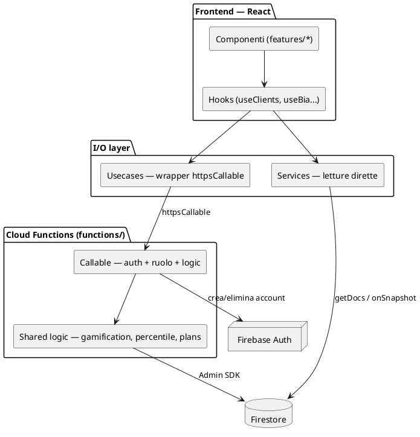

### 02 — Infrastruttura di deploy multi-progetto
*Deployment diagram · Infrastruttura & Deployment*

**Cosa mostra:** 2 progetti Firebase (rankex-dev / fitquest-60a09), hosting multisito,
Firestore, Cloud Functions (europe-west1), pipeline CI/CD a due branch.
**Perché è il primo:** chiarisce cosa è automatico (hosting+rules via `deploy.yml`) e
cosa va rilasciato a mano (le Cloud Functions) — fonte reale di incidenti di deploy.
**Fonte:** Ambienti e infrastruttura, Branching e CI/CD.

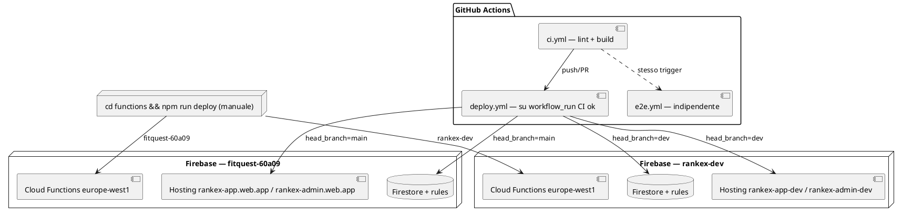

### 03 — Modello dati Firestore
*Class diagram · Dominio & Dati*

**Cosa mostra:** Organization → members / clients / slots / groups / recurrences /
notifications / workoutPlans; clients → notes (subcollection); users e audit_logs a parte.
**Perché è il primo:** ogni feature nuova parte da qui — è la mappa che risponde a
"dove vive questo dato".
**Fonte:** Struttura Firestore, Modelli dati.

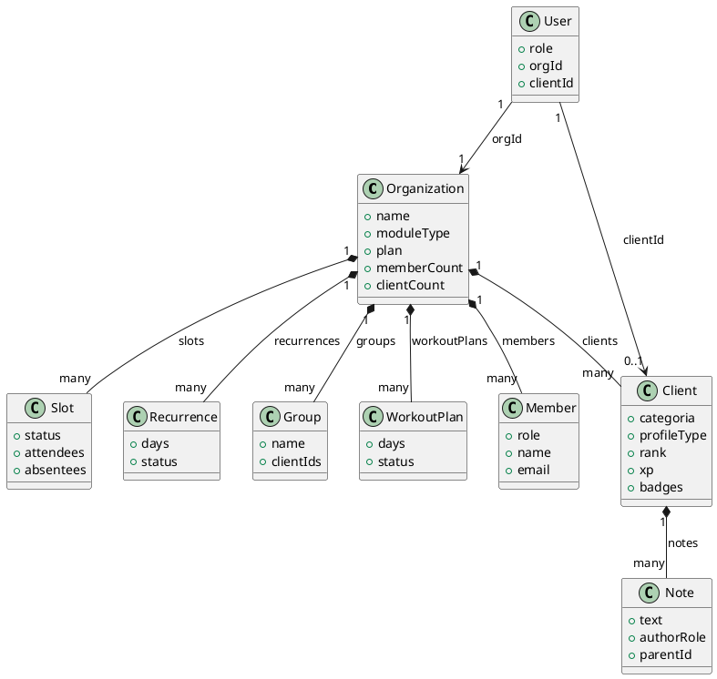

*Nota: `audit_logs/{logId}` è omesso — è una collection root indipendente, senza
relazione di composizione con Organization.*

### 04 — Ruoli e casi d'uso
*Use case diagram · Casi d'uso / Ruoli*

**Cosa mostra:** 5 ruoli (super_admin / org_admin / trainer / staff_readonly / client)
e le azioni che ciascuno può compiere, incl. restrizione readonly.
**Perché è il primo:** mappa 1:1 su routing (`routes.config`, `ProtectedRoute`) e
`ReadonlyContext` — utile anche a stakeholder non tecnici.
**Fonte:** Ruoli utente, Routing per ruolo.

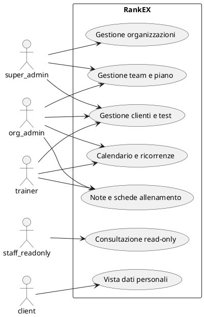

### 05 — Sequenza — creazione cliente end-to-end
*Sequence diagram · Comportamento & Processi*

**Cosa mostra:** `NewClientView` → `createClientUseCase` → callable `creaCliente` →
`requireOrgAccess` + `withinClientLimit` → batch Firestore (`clientCount` +1) +
creazione account Auth → `auditLog`.
**Perché è il primo:** è il rappresentante canonico del "write pattern" sensibile —
letto questo, le altre callable si leggono per analogia diretta.
**Fonte:** Backend — Cloud Functions callable, Checklist: Membro del team.

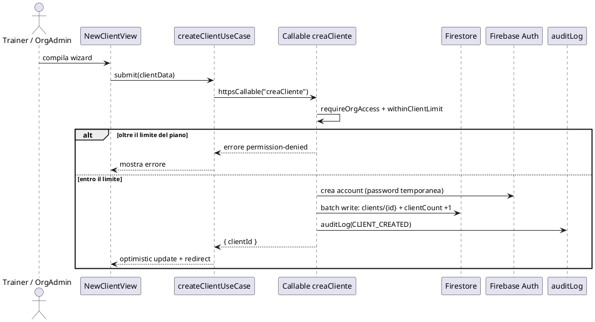

---

## Livello 2 — Importanti

### 06 — Stato — ciclo di vita Slot
*State diagram · Comportamento & Processi · Fonte: sezione Calendario*

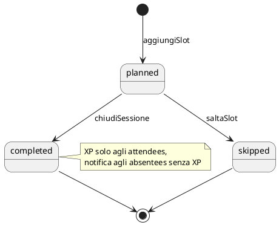

### 07 — Stato — ciclo di vita Ricorrenza
*State diagram · Comportamento & Processi · Fonte: sezione Ricorrenza / Calendario*

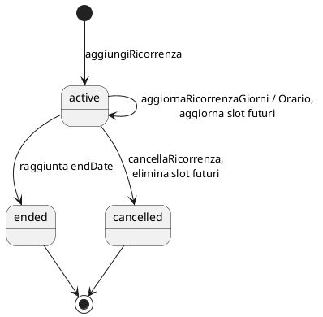

### 08 — Stato — profileType cliente (PT)
*State diagram · Dominio & Dati · Fonte: BIA — Upgrade categoria*

Solo `personal_training` — soccer resta sempre `tests_only`.

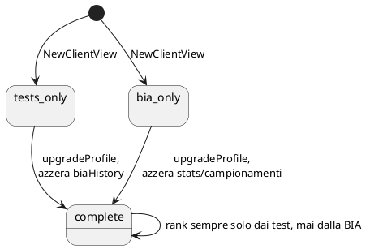

### 09 — Attività — motore gamification XP
*Activity diagram · Comportamento & Processi · Fonte: sezione Gamification*

Cap streak a 10 → moltiplicatore ×2.0.

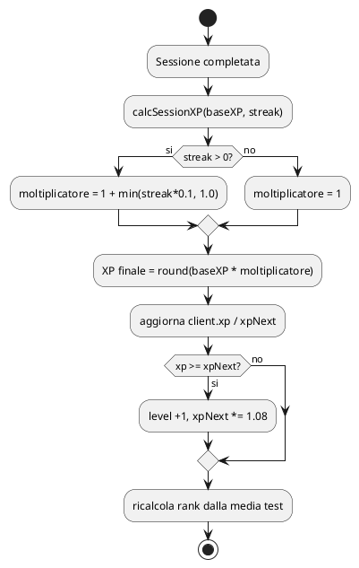

### 10 — Attività — calcolo percentili
*Activity diagram · Dominio & Dati · Fonte: Calcolo percentili — nota tecnica*

`testKey` obbligatorio per stat condivisi (es. "resistenza", 5 test).

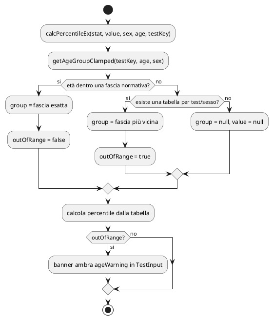

### 11 — Sequenza — chiusura sessione calendario
*Sequence diagram · Comportamento & Processi · Fonte: sezione Calendario*

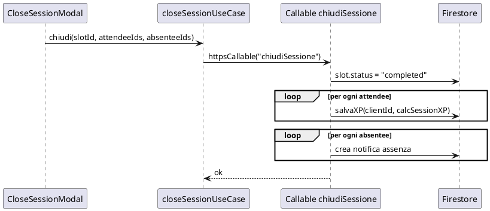

### 12 — Sequenza — login, sessione, DomainGuard
*Sequence diagram · Sicurezza · Fonte: sezione Sicurezza*

DomainGuard disattivo in dev (localhost).

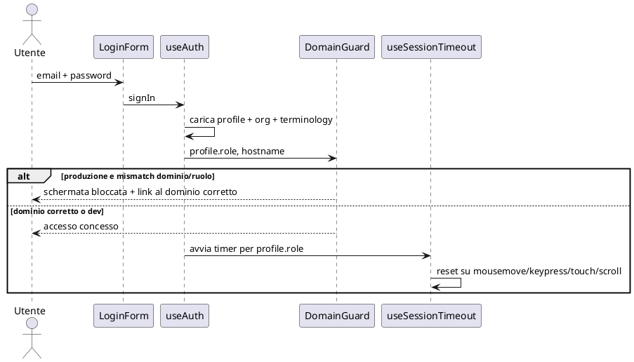

### 13 — Componenti — albero dei Context React
*Component diagram · Architettura & Componenti · Fonte: context/*

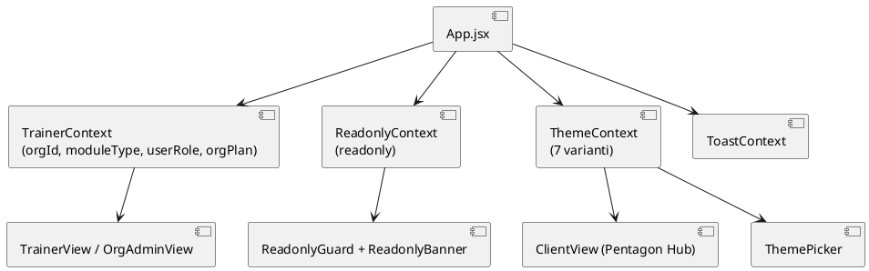

### 14 — Classi — sistema Moduli (PT vs Soccer)
*Class diagram · Dominio & Dati · Fonte: config/modules.config.js*

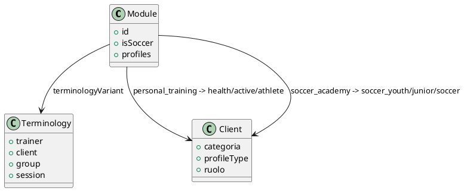

### 15 — Package — mappa cartelle src/
*Package diagram · Architettura & Componenti · Fonte: Struttura cartelle*

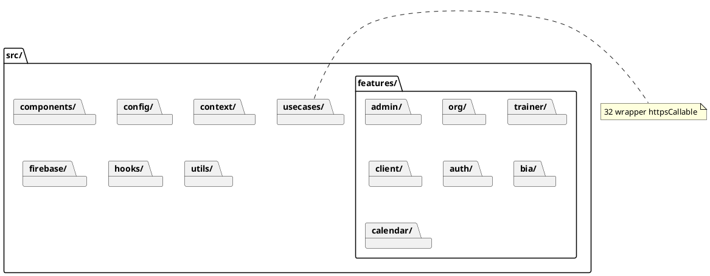

### 16 — Componenti — Calendario (Month/Week/Day)
*Component diagram · Architettura & Componenti · Fonte: features/trainer/trainer-calendar/*

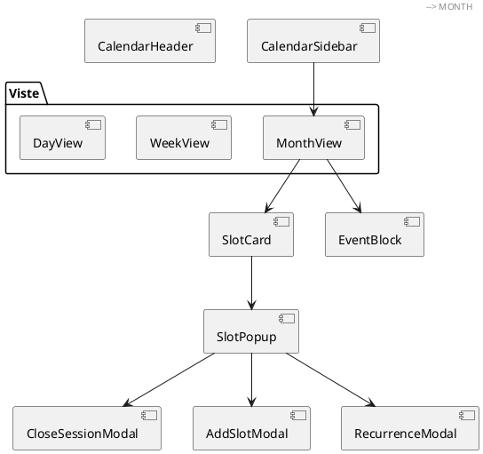

### 17 — Decisione — permessi Firestore Rules
*Activity diagram · Sicurezza · Fonte: firestore.rules righe 7-76*

Nomi funzione reali, verificati via grep — non una ricostruzione approssimativa.

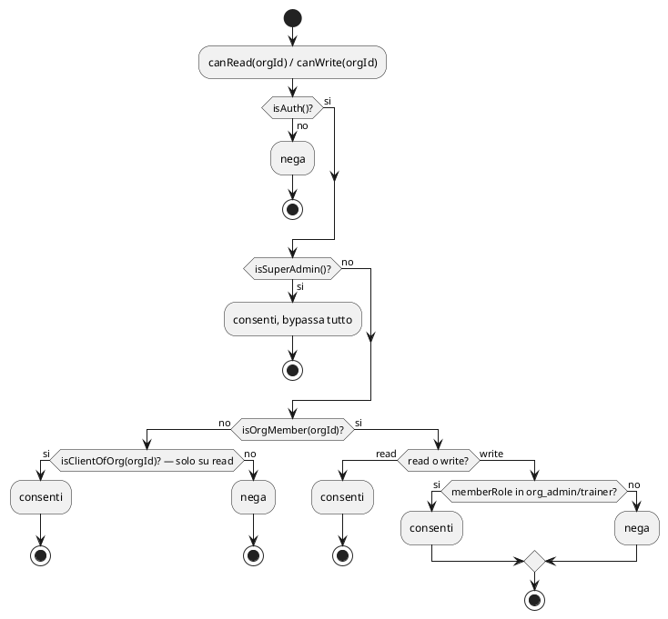

### 18 — Componenti — Groups Analytics Hub (6 tab)
*Component diagram · Architettura & Componenti · Fonte: features/trainer/groups-page/*

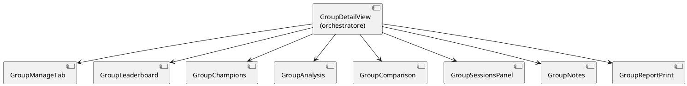

### 19 — Componenti — Client Pentagon Hub
*Component diagram · Architettura & Componenti · Fonte: features/client/client-view/*

Formula vertici: `(90 - i*72) * PI/180`.

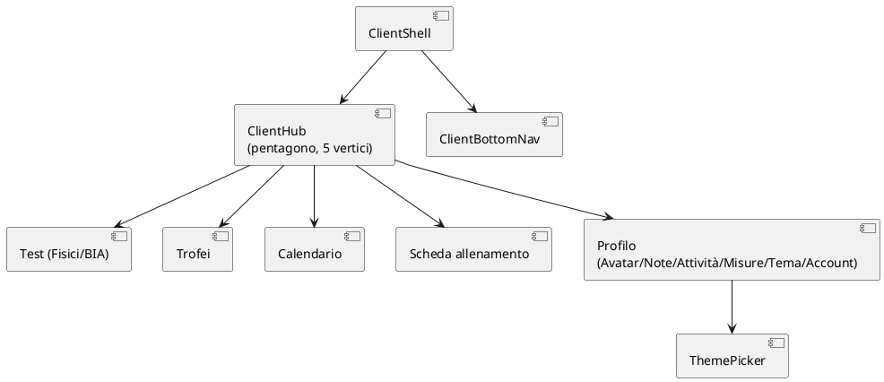

### 20 — Attività — wizard nuovo cliente
*Activity diagram · Comportamento & Processi · Fonte: NewClientView, wizard.config.js*

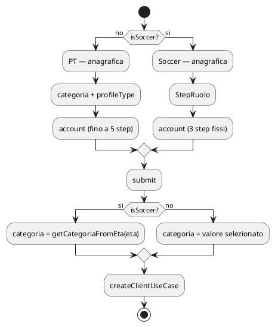

### 21 — Decisione — enforcement limiti piano SaaS
*Activity diagram · Sicurezza · Fonte: config/plans.config.js + firestore.rules*

Doppio controllo: UI (comodità) + rules (sicurezza).

```plantuml
@startuml
start
:Trainer clicca AGGIUNGI (cliente o membro);
if (UI: length >= getPlanLimits(plan)?) then (si)
  :banner giallo + bottone disabilitato,\no schermata di blocco;
  stop
else (no)
  :procede — createClientUseCase / createMemberUseCase;
endif
:Callable — requireOrgAccess;
if (isSuperAdmin?) then (si)
  :bypassa il limite;
else (no)
  if (withinClientLimit / withinTrainerLimit?) then (no)
    :reject — anche se la UI l'avesse permesso;
    stop
  else (si)
  endif
endif
:batch write — crea doc + counter +1;
stop
@enduml
```

---

## Livello 3 — Specialistici

### 22 — Sequenza — sync gruppo ↔ calendario
*Sequence diagram · Comportamento & Processi · Fonte: Sync gruppo/calendario*

```plantuml
@startuml
participant "GroupToggleDialog" as UI
participant "Group" as GRP
participant "Slot futuri" as SLOT
participant "Recurrence attive" as REC

UI -> UI: mostra preview (slot futuri + ricorrenze coinvolte)
UI -> GRP: conferma toggle cliente
GRP -> GRP: aggiorna group.clientIds
GRP -> SLOT: aggiorna slot futuri non ricorrenti
GRP -> REC: aggiorna ricorrenze attive
REC -> SLOT: sync slot futuri della ricorrenza
note over SLOT: slot passati — invariati
@enduml
```

### 23 — Sequenza — rimozione membro (cascade delete)
*Sequence diagram · Sicurezza · Fonte: firebase/services/org.js*

```plantuml
@startuml
participant "MembersPage" as UI
participant "removeMemberUseCase" as UC
participant "Callable rimuoviMembroTeam" as CF
participant "Firebase Auth" as Auth
participant "Firestore" as FS

UI -> UC: rimuovi(uid)
UC -> CF: httpsCallable("rimuoviMembroTeam")
CF -> CF: requireOrgAdmin o super_admin
CF -> Auth: elimina account
CF -> FS: elimina users/{uid}
CF -> FS: elimina members/{uid}
CF -> FS: memberCount -1, batch
CF --> UC: ok
note over CF: fix reale: un deleteDoc diretto sul solo membro\nlasciava l'account attivo
@enduml
```

### 24 — Attività — motore Badge / Trofei
*Activity diagram · Comportamento & Processi · Fonte: Gamification avanzata — Badge*

8 badge auto: prima sessione, primo test, striscia x5/x10/x25, primo rank-up, top performer,
rank massimo (corretto da un mio conteggio errato: ne avevo scritti 7, dimenticando "primo test").

```plantuml
@startuml
start
:cambio dati cliente, non readonly;
:useBadges — checkAutoBadges;
if (badge auto già assegnato?) then (si)
  :skip;
  stop
else (no)
endif
if (condizione soddisfatta?) then (si)
  :awardBadge(clientId, badgeId);
  :client.badges[id] = awardedAt + awardedBy: system;
  if (badgeShowcase.length < 5?) then (si)
    :cliente può fissarlo in evidenza;
  else (no)
  endif
else (no)
endif
stop
@enduml
```

### 25 — Stato — Wearable (feature disattivata)
*State diagram · Sicurezza · Fonte: Wearable — Google Fit*

Bottone ABILITA nascosto in `WearableSection.jsx`.

```plantuml
@startuml
[*] --> mai_collegato
mai_collegato --> mai_collegato : nessuna azione disponibile,\nentry point rimosso
[*] --> abilitato_in_passato
abilitato_in_passato --> disabilitato : trainer clicca DISABILITA
disabilitato --> [*]
@enduml
```

### 26 — Classi — design tokens & 7 temi client
*Class diagram · Architettura & Componenti · Fonte: config/themes.config.js*

Persistenza in `localStorage['rankex-theme']`.

```plantuml
@startuml
class Theme {
  +id
  +rxBg
  +rxSurface
  +rxAccent
  +rxAccent2
  +rxText
}
class ThemeContext {
  +activeTheme
  +setTheme()
}
ThemeContext --> Theme : applica via CSS custom properties
Theme <|-- RankEX
Theme <|-- Midnight
Theme <|-- Carbon
Theme <|-- Violet
Theme <|-- Steel
Theme <|-- Phantom
Theme <|-- Mint
@enduml
```

### 27 — Sequenza — export PDF via window.print
*Sequence diagram · Comportamento & Processi · Fonte: Export PDF atleta*

Zero dipendenze aggiuntive.

```plantuml
@startuml
participant "Menu overflow" as UI
participant "ClientReportPrint" as Print
participant "document.head" as DOM
participant "window.print()" as Browser

UI -> Print: onExport()
Print -> DOM: inietta CSS @media print
DOM -> DOM: nasconde tutto tranne #rankex-print-root
Print -> Browser: window.print()
Browser --> UI: dialogo di stampa nativo, salva come PDF
@enduml
```

### 28 — Classi — audit log append-only
*Class diagram · Sicurezza · Fonte: Audit log*

Convertito da ER a class diagram: ER non è notazione UML.

```plantuml
@startuml
class AuditLog {
  +action
  +uid
  +email
  +timestamp
  +userAgent
  +env
}
class SuperAdmin
SuperAdmin --> AuditLog : legge, unico ruolo autorizzato
note bottom of AuditLog : append-only — nessun update/delete consentito da firestore.rules
@enduml
```

### 29 — Componenti — copie speculari client/server
*Component diagram · Architettura & Componenti · Fonte: Copie speculari — rischio di divergenza*

Nessun controllo automatico le sincronizza.

```plantuml
@startuml
package "src/" {
  [utils/gamification.js] as G1
  [constants/index.js] as C1
  [config/plans.config.js] as P1
  [constants/tests.js] as T1
}
package "functions/src/shared/" {
  [gamification.js] as G2
  [constants.js] as C2
  [plans.js] as P2
  [testsMeta.js — minimale] as T2
}
G1 ..> G2 : duplicato manuale, no import
C1 ..> C2 : duplicato manuale
P1 ..> P2 : duplicato manuale
T1 ..> T2 : solo campi essenziali
@enduml
```

### 30 — Sequenza — upgrade profilo cliente
*Sequence diagram · Dominio & Dati · Fonte: BIA — Upgrade categoria*

```plantuml
@startuml
participant "BiaView / UpgradeCategoryBanner" as UI
participant "upgradeProfileUseCase" as UC
participant "Callable aggiornaProfiloCliente" as CF
participant "Firestore" as FS

UI -> UC: upgrade(clientId, "complete")
UC -> CF: httpsCallable("aggiornaProfiloCliente")
alt da tests_only
  CF -> FS: mantiene stats/campionamenti, azzera biaHistory
else da bia_only
  CF -> FS: mantiene biaHistory, azzera stats/campionamenti
end
CF -> FS: client.profileType = "complete"
CF --> UC: ok
@enduml
```

### 31 — Componenti — script di manutenzione e migrazione dati
*Component diagram · Architettura & Componenti · Fonte: scripts/*.mjs (15 file) + AdminDashboard.jsx*

`recalcolaCampionamenti` (la callable) è l'**unica delle 32 senza un file dedicato in
`src/usecases/`** (31 file lì, non 32 — il conto torna esattamente con questa
eccezione): viene chiamata con `httpsCallable` diretto da `AdminDashboard.jsx`
(super_admin, con dry-run prima della conferma). **Correzione a una correzione
precedente:** avevo scritto che anche lo script `recalcolo-campionamenti.mjs` chiama
questa callable — falso, letto il codice di entrambi. Sono due implementazioni
indipendenti della stessa logica: il commento in testa alla callable dice
letteralmente *"Migra la logica di scripts/recalcolo-campionamenti.mjs lato server"*
— lo script (Admin SDK + service account, da terminale) è venuto prima, la callable è
la sua evoluzione per essere richiamabile in sicurezza dall'app (`requireRole`,
`dryRun`), non un wrapper che lo invoca. Nessuna freccia tra i due. I tre script
`analyze.mjs` / `md-to-html.mjs` / `ux-test.mjs` mancavano dal diagramma — aggiunti in
"Tooling vario".

```plantuml
@startuml
package "Migrazione dati" {
  [import-vdp5-05-05-26.mjs] as S1
  [migrate-potenza-to-esplosivita.mjs] as S2
}
package "Ricalcolo percentili" {
  [recalcolo-campionamenti.mjs\n(precede la callable, non la chiama)] as S3
  [recalcolo-sprint20m-vdp5.mjs] as S4
  [recalcolo-t-test-mini-vdp5.mjs] as S5
}
package "Seed ambienti di test" {
  [seed-badges-test.mjs] as S6
  [seed-test-accounts.mjs] as S7
  [seed-newclient-test-account.mjs] as S8
}
package "Tooling vario" {
  [check-wearable-tokens.mjs] as S9
  [theme-replace.mjs] as S10
  [screenshot-client.mjs / screenshot-themes.mjs] as S11
  [analyze.mjs — analisi statica codebase] as S12
  [md-to-html.mjs] as S13
  [ux-test.mjs — Playwright, UX audit] as S14
}
database "Firestore" as FS
[Callable recalcolaCampionamenti\n(requireRole super_admin, dryRun)] as CF
[AdminDashboard.jsx\n(super_admin, dry-run + confirm)] as ADMIN

S3 --> FS : Admin SDK diretto (service account, una tantum)
S4 --> FS : Admin SDK diretto
S5 --> FS : Admin SDK diretto
ADMIN --> CF : httpsCallable diretta
CF --> FS
@enduml
```

### 32 — Sequenza — sync slot futuri da Ricorrenza
*Sequence diagram · Comportamento & Processi · Fonte: 7 callable dedicate alla Ricorrenza*

```plantuml
@startuml
participant "Ricorrenza (usecases)" as UC
participant "Callable" as CF
participant "Firestore" as FS

UC -> CF: aggiungiRicorrenza(days, startDate, endDate)
CF -> FS: genera N slot futuri, uno per occorrenza
UC -> CF: estendiRicorrenza(nuovaEndDate)
CF -> FS: genera altri slot fino alla nuova data
UC -> CF: aggiornaRicorrenzaGiorni / aggiornaRicorrenzaOrario
CF -> FS: aggiorna solo gli slot futuri esistenti
UC -> CF: aggiungiClienteRicorrenza / rimuoviClienteRicorrenza
CF -> FS: sync clientIds sugli slot futuri
UC -> CF: cancellaRicorrenza
CF -> FS: status = cancelled, elimina slot futuri
@enduml
```

### 33 — Componenti — divergenza ClientDashboard / ClientDashboardPage
*Component diagram · Architettura & Componenti · Fonte: Dashboard cliente — layout*

Nessun `AvatarPlaceholder` o layout 2 colonne condiviso, a differenza della doc
apr 2026 (obsoleta).

```plantuml
@startuml
package "ClientDashboard.jsx — vista trainer" {
  [Header: back + tab bar + menu] as T1
  [Tab sempre visibili, 10, scrollabili] as T2
}
package "ClientDashboardPage.jsx — vista client" {
  [ClientHub — pentagono, avatar al centro] as C1
  [ClientBottomNav] as C2
}
T1 ..> C1 : pattern divergenti dal redesign giu 2026
@enduml
```

### 34 — Classi — modello dati Badge/Trofei
*Class diagram · Dominio & Dati · Fonte: config/badges.config.js, letto direttamente*

8 badge auto + 6 manuali su un unico array `BADGES`.

```plantuml
@startuml
class BADGE_TIERS {
  +bronze
  +silver
  +gold
  +platinum
}
class Badge {
  +id
  +label
  +description
  +tier
  +type
  +icon
}
class BADGES {
  +Badge[]
}
class AUTO_BADGES
class MANUAL_BADGES
class ClientBadges {
  +awardedAt
  +awardedBy
  +note
}
BADGES --> Badge : contiene
Badge --> BADGE_TIERS : tier
AUTO_BADGES ..> BADGES : filter type=="auto"
MANUAL_BADGES ..> BADGES : filter type=="manual"
ClientBadges --> Badge : id
@enduml
```

### 35 — Sequenza — pipeline CI/CD multi-branch
*Sequence diagram · Infrastruttura & Deployment · Fonte: .github/workflows/*

```plantuml
@startuml
participant "Developer" as Dev
participant "GitHub" as GH
participant "ci.yml" as CI
participant "e2e.yml" as E2E
participant "deploy.yml" as Deploy

Dev -> GH: push su dev o main, o PR verso main
GH -> CI: trigger
GH -> E2E: trigger indipendente
CI -> CI: lint + build
alt CI fallita
  CI --> GH: stop, nessun deploy
else CI ok
  CI -> Deploy: workflow_run completato con successo
  alt head_branch = dev
    Deploy -> Deploy: job deploy-dev, verso rankex-dev
  else head_branch = main
    Deploy -> Deploy: job deploy-prod, verso fitquest-60a09
  end
end
note over E2E: un fallimento e2e non blocca né ritarda deploy.yml
@enduml
```

---

## Scostamenti emersi ispezionando il repo (non dal documento tecnico)

`functions/src/callable/` contiene 32 file, ma `src/usecases/` solo 31 —
`recalcolaCampionamenti` è la sola callable senza un usecase dedicato: viene chiamata
con `httpsCallable` diretto da `AdminDashboard.jsx` (super_admin, dry-run + conferma).
Non è invocata dallo script `scripts/recalcolo-campionamenti.mjs` — quello scrive
Firestore per conto proprio via Admin SDK; la callable ne è una migrazione successiva
della stessa logica, non un suo chiamante (vedi #31 — doppia correzione: prima l'avevo
descritta solo come tooling di manutenzione ignorando l'uso in app, poi avevo pure
inventato una chiamata script→callable che leggendo il codice non esiste). La cartella
`functions/src/triggers/` descritta
nell'albero del documento tecnico non esiste ancora — oggi `functions/src/` ha solo
`index.js` e `callable/`.

Badge: `config/badges.config.js` ha **8** badge automatici, non 7 come avevo scritto
inizialmente nei diagrammi #24 e #34 — mancava "primo test" (`primo_campionamento`)
dal conteggio.

I due diagrammi con più superficie di sicurezza sono **#17** (permessi Firestore) e
**#21** (limiti piano) — validarli con chi conosce le regole a memoria prima di usarli
in onboarding esterno.
